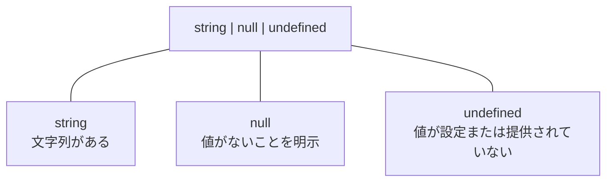

# nullとundefinedの違い

JavaScriptには、値の不在に関係する`null`と`undefined`という別々のプリミティブ値がある。

両者は同じ値ではなく、TypeScriptでも別の型として扱われる。

## undefined

`undefined`は、値がまだ設定または提供されていない場面で現れる。

たとえば、初期値を与えていない変数や、存在しないプロパティを読み取った結果は`undefined`になる。

```js
let result
console.log(result) // undefined

const user = {}
console.log(user.nickname) // undefined
```

省略された関数の引数や、値を`return`しなかった関数の戻り値も`undefined`になる。

このように、`undefined`はJavaScriptの実行結果として自動的に現れることが多い。

## null

`null`は、値が存在しないことをプログラムやAPIが明示するときに使われることが多い。

```ts
type User = { name: string }

let selectedUser: User | null = null
```

この例では、`selectedUser`に利用者情報が入る可能性はあるが、現在は選択されていないことを`null`で表している。

ただし、この使い分けは言語が強制する規則ではない。

プログラムから`undefined`を明示的に代入することもできる。

## 別々の値と型

`string | null | undefined`は一つの曖昧な型ではなく、値が次の三種類のいずれかになることを表すユニオン型である。



この図の線は処理の順番ではなく、ユニオン型を構成する選択肢の分類を示している。

[ECMAScript仕様](https://tc39.es/ecma262/#sec-ecmascript-language-types)は、`undefined`と`null`をそれぞれ一つの値だけを持つ別々の言語型として定義している。

## TypeScriptでの扱い

[`strictNullChecks`](https://www.typescriptlang.org/tsconfig/#strictNullChecks)が有効な場合、`null`と`undefined`は通常の`string`や`number`とは別の型として検査される。

```ts
const title: string = null
// エラー: nullはstringに代入できない
```

`null`を許可する場合は、ユニオン型で明示する。

```ts
let title: string | null = null

title = "TypeScript入門"
```

`undefined`も許可する場合は、同じように型へ追加する。

```ts
let title: string | undefined = undefined

title = "TypeScript入門"
```

値を使う前には、実際の値が入っているか確認する。

```ts
function printTitle(title: string | null) {
  if (title === null) {
    console.log("タイトルなし")
    return
  }

  console.log(title.toUpperCase())
}
```

この検査により、`if`文の後では`title`が`string`であることをTypeScriptが判断できる。

## 参考資料

- [ECMAScript Language Specification: ECMAScript Language Types](https://tc39.es/ecma262/#sec-ecmascript-language-types)
- [TypeScript Handbook: null and undefined](https://www.typescriptlang.org/docs/handbook/2/everyday-types.html#null-and-undefined)
- [TypeScript TSConfig Reference: strictNullChecks](https://www.typescriptlang.org/tsconfig/#strictNullChecks)
- [サバイバルTypeScript](https://typescriptbook.jp/)
